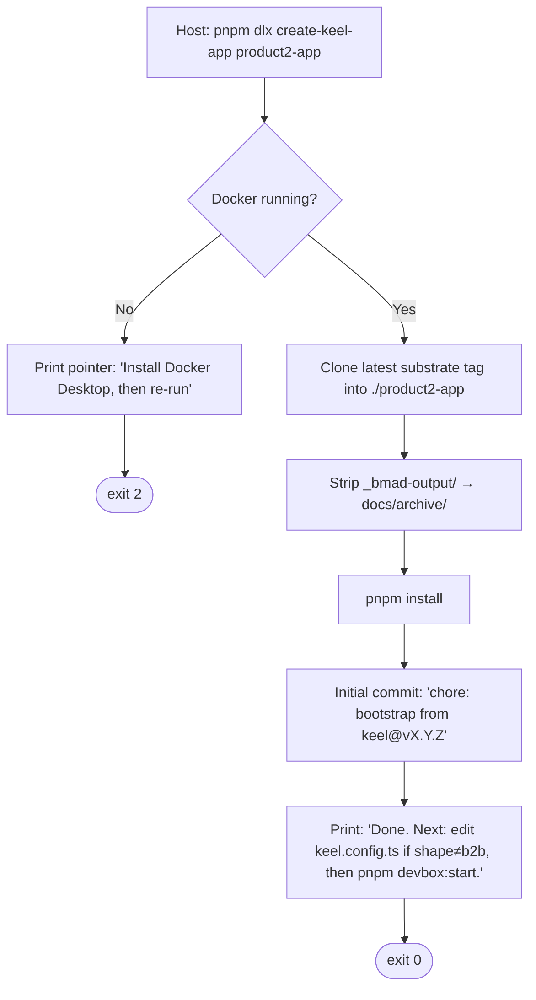
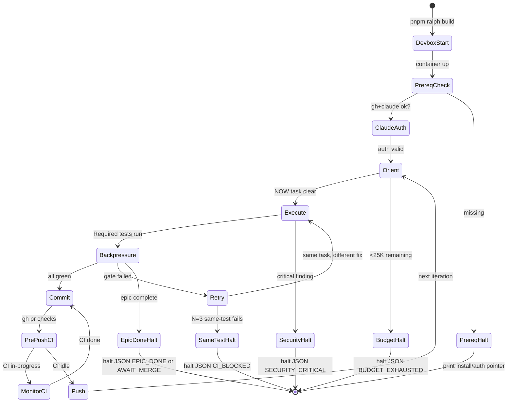
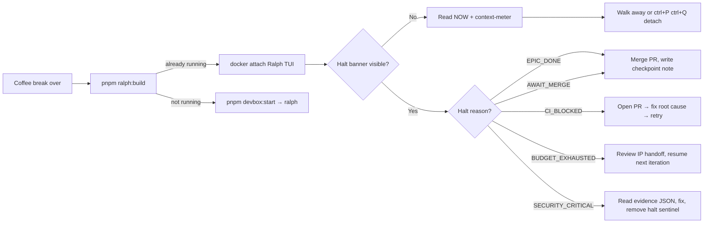
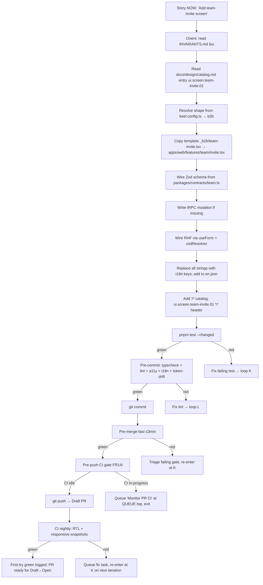
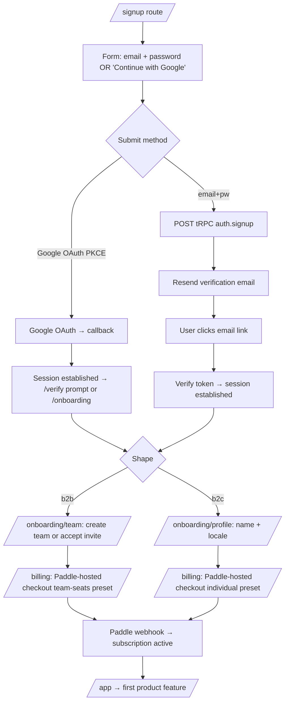

---
stepsCompleted:
  - 1
  - 2
  - 3
  - 4
  - 5
  - 6
  - 7
  - 8
  - 9
  - 10
  - 11
  - 12
  - 13
  - 14
lastStep: 14
completedAt: '2026-04-18'
inputDocuments:
  - _bmad-output/planning-artifacts/prd.md
  - _bmad-output/planning-artifacts/prfaq-ralph-bmad.md
  - _bmad-output/planning-artifacts/prfaq-ralph-bmad-distillate.md
  - _bmad-output/planning-artifacts/prd-validation-report.md
  - _bmad-output/planning-artifacts/research/technical-keel-ralph-bmad-research-2026-04-17.md
  - _bmad-output/brainstorming/brainstorming-session-2026-04-17-0910.md
  - docs/ralph.md
  - docs/invariants/knowledge-files.md
  - docs/invariants/ralph-execute.md
  - docs/absorption-tripwire/vertical-slice-acceptance.md
documentCounts:
  prds: 1
  prfaqs: 2
  validationReports: 1
  research: 1
  brainstorming: 1
  projectDocs: 3
scopeConfirmed:
  - Ralph/Keel TUI (Python Textual, runs inside devbox) — iteration observability + attach/detach
  - Scaffolded baseline web UIs in forks (signup, login, password/email verify, team/invite flows for B2B, individual profile for B2C, billing/Paddle, locale selector)
  - Forms and interaction patterns (react-hook-form + Zod driven)
  - Comprehensive design system — off-the-shelf preferred, agent-followable
baselineInvariants:
  - responsive: mobile-first, adaptive across viewport classes; baked in from day zero
  - a11y: WCAG 2.1 Level AA floor (per PRD NFR20); keyboard-operable, screen-reader-semantic, contrast-compliant
  - i18n/l10n: typed-key enforced (per PRD FR24–27), locale-aware, RTL via logical CSS properties (per PRD NFR21)
authoritativeSource: _bmad-output/planning-artifacts/prd.md
---

# UX Design Specification — Keel

**Author:** Tthew
**Date:** 2026-04-18

---

<!-- UX design content will be appended sequentially through collaborative workflow steps -->

## Executive Summary

### Project Vision

Keel's UX spec covers three distinct-but-coupled surfaces — the Ralph/Keel TUI (agentic-workflow dashboard running inside the devbox), the scaffolded baseline web UIs inherited by every Keel fork (auth, teams/profile, billing, audit, locale), and the design-system library that governs both. The spec's load-bearing choice is that **the design system is treated as a source-layer invariant, not a taste decision**: the primary applier is an AI agent (Claude Code under Ralph), so components, tokens, and patterns must be LLM-consumable, copy-paste-safe, and enforceable at pre-merge. Off-the-shelf is strongly preferred over bespoke. Three baseline qualities are non-negotiable across every surface: screen-size responsivity/adaptability, WCAG 2.1 AA accessibility, and typed-key i18n/l10n with RTL parity.

### Target Users

- **Primary (N=1): Tthew.** Experienced solo builder using BMad + Ralph + Claude Code; desktop-first (Apple-Silicon); interacts with the Ralph TUI, the `pnpm`-exposed CLI, and Tthew-authored product UIs inside Keel forks. Rejects bespoke-for-bespoke's-sake; demands invariants that are materially enforced, not conventional.
- **Operating: Ralph + Claude Code.** The non-human user that produces the majority of UI code in Keel forks. Success = the agent can author a new scaffolded screen and have it pass WCAG AA, i18n enforcement, responsive-snapshot, and import-boundary checks on the first CI run.
- **Downstream (pass-through): end users of products shipped on Keel forks.** They experience the scaffolded baseline (signup, billing, locale selector). Not the design target; they are the correctness constraint (AA floor, i18n correctness, RTL parity, responsive phone → desktop behaviour).

### Key Design Challenges

1. **Design system as invariant, not taste.** The component library must be one the agent can apply without judgment — copy-paste-safe, LLM-consumable docs, token-driven, AA-first. Swapping the system post-1.0 is a fork-level change, not a config toggle.
2. **Two product shapes from one component set.** B2B (team tenancy, team-seats billing, invites/roles) and B2C (user tenancy, individual subscription, personal profile) share primitives but diverge at page-template level. A shape-aware composition layer must keep the design system un-forked.
3. **TUI ≠ web, but shares semantic invariants.** Textual doesn't consume CSS; a shared *semantic token set* (status, severity, density) is the contract both the Textual theme and the Tailwind config read.
4. **Responsive + adaptive baked in.** Every scaffolded screen works from ~360px phone → desktop without agent discretion. Mobile-first Tailwind, container queries where nesting demands them, logical CSS properties throughout for RTL parity.
5. **a11y + i18n are compile-time, not review-time.** ESLint-plugin-jsx-a11y + axe-core in CI; typed i18n keys (PRD FR27) fail the build on bare strings; AA contrast enforced on design tokens via automated ratio checks.
6. **Agent-authorable forms.** react-hook-form + Zod is the only contract — one right way; no branching patterns the agent has to choose between.

### Design Opportunities

1. **Design-tokens-as-invariants.** Extend `packages/keel-invariants/` with a token manifest (color semantics, type scale, spacing rhythm, motion, density); pre-merge gate fails on drift between the manifest and its consumers (Tailwind config + Textual theme) — same three-layer invariants pattern the PRD already pins for code.
2. **Agent-loadable component catalog.** A `docs/design/catalog.md` enumerating every primitive + composition pattern with copy-paste examples, keyed by stable IDs and referenced from `INVARIANTS.md §ui`. The agent cites the catalog rather than inventing patterns.
3. **TUI as observability-grade dashboard.** NOW/QUEUE/BLOCKED/DONE as a fixed-layout kanban with log-tail + halt banner + context-meter footer — echoes conventions N=1 already reads (Grafana/k9s), no learning cost.
4. **Status + severity as shared semantics.** One vocabulary across TUI and web (info/success/warning/error/critical; pending/in-progress/blocked/done) — single source of truth for copy, color, iconography.
5. **Accessibility as a research output.** The monthly absorption-tripwire's vertical slice includes an axe-core pass; a11y becomes a capability the agent demonstrates, not a checklist.

## Core User Experience

### Defining Experience

Keel's core experience is defined across three interlocking loops — each with its own actor, its own surface, and its own effortless bar. A fourth meta-loop (the agent authoring new screens in a fork) is the invisible integration test that validates whether the design-system-as-invariant actually holds.

- **Loop A — Tthew observes Ralph (TUI).** Re-attach → glance → either walk away or course-correct, in < 5s of reading. The TUI is a status instrument, not a driving surface.
- **Loop B — Tthew or agent runs a host-side command (`pnpm <subcommand>`).** One verb, one noun, predictable output. Echoes k9s / gh / kubectl muscle memory.
- **Loop C — End user completes a scaffolded flow (signup → verify → pay → use).** Zero bespoke decisions inside; the scaffolded baseline is already correct (AA, i18n, responsive, RTL, shape-aware).
- **Loop D (meta) — Agent authors a new screen.** Reads catalog → applies primitive → CI passes on first try (a11y + i18n + responsive + import-boundary + shape-aware).

### Platform Strategy

| Surface              | Platform                                       | Input           | Output              | Notes                                       |
|----------------------|------------------------------------------------|-----------------|---------------------|---------------------------------------------|
| Ralph TUI            | Python Textual, inside devbox container        | Keyboard        | ANSI terminal       | Ctrl+P Ctrl+Q detach; streams `.ralph/logs/` |
| CLI                  | `pnpm <subcommand>` on host (macOS primary)    | Keyboard        | Plain text + exit code | Container lifecycle + command forward      |
| Scaffolded web UIs   | TanStack Start app in any modern browser       | Touch + keyboard + mouse | Responsive HTML | Mobile-first; ≥ 360px min viewport         |
| Agent-authored code  | Substrate — tRPC + RHF + Zod + Tailwind        | n/a             | n/a                 | The substrate is the platform               |

**Primary input paradigm.** Keyboard-first for Tthew (TUI + CLI + authoring); touch+keyboard for end users hitting scaffolded web flows. No native mobile/desktop app, no offline PWA at 1.0.

**Responsive envelope.** Mobile-first Tailwind breakpoints (`sm` 640, `md` 768, `lg` 1024, `xl` 1280, `2xl` 1536). Minimum viewport 360×640. Container queries for nested composition. Logical CSS properties everywhere — physical `margin-left` / `padding-right` is a lint-fail.

### Effortless Interactions

**For Tthew (TUI + CLI):**

- Re-attach to Ralph without losing log-tail scroll position.
- Read halt reason at a glance via color-coded banner (closed enum from halt schema).
- See NOW task without scrolling — always top-left TUI quadrant.
- `pnpm ralph:stop` is one keystroke-sequence away; no menu digging.

**For the agent (authoring):**

- Find the right primitive in one grep — catalog IDs are stable and greppable.
- Copy a component with zero modifications required for a11y / i18n / responsive.
- Know which shape a page belongs to without guessing — page templates are shape-partitioned.
- Fail fast on drift — pre-merge gates reject bare strings, missing ARIA, non-semantic tokens.

**For the end user (scaffolded flows):**

- Sign up in ≤ 3 fields + OAuth button.
- Verify email with a single click.
- Start a paid subscription via Paddle-hosted checkout.
- Switch locale persistently without re-login.
- Invite a teammate (B2B) with one email + one role dropdown.

**Automatic (no user intervention):**

- Devbox auto-starts on `pnpm ralph:*` invocation.
- Generator runs on pre-commit when `keel.config.ts` changes.
- Tenant context set per-request by `tenantGuard()` automatically.
- Locale detected from `Accept-Language`, overrideable by user preference.
- i18n keys validated at build; missing keys fail CI.

**Steps eliminated vs boilerplate competitors (ShipFast / Makerkit / Supastarter):**

- No "choose a framework" step — one hardwired answer.
- No "wire up auth" step — already wired.
- No "configure RLS" step — policies generated from `keel.config.ts`.
- No "choose a design system" step — picked, pinned, token-enforced.
- No "set up i18n" step — framework wired, English baseline, typed-keys enforced.

### Critical Success Moments

1. **First Ralph re-attach.** If the TUI is disorienting on the first re-attach, Tthew stops trusting it and grep-logs instead. Bar: glanceable in one screenful.
2. **First `create-keel-app` run.** If it prompts for anything, it breaks the non-interactive invariant and the "decisions pre-made" promise.
3. **Agent's first scaffolded screen.** If the agent must choose between two ways to do a form, the design system has failed. Bar: exactly one pattern per screen kind.
4. **End-user's first signup.** A bare-string fail, a bad contrast ratio, a locale bug at signup lands as "Tthew shipped another half-finished SaaS." Bar: scaffolded baseline is correct on day zero.
5. **First mobile viewport.** If responsive breaks at 360px, agent or Tthew post-hoc-fixes it — a convention-leak back into what was supposed to be an invariant.
6. **First `SECURITY_CRITICAL` halt.** Bar: banner reason + one-line summary + path-to-evidence, no scrolling.
7. **First RTL locale test.** Bar: zero component-level fixes; logical-properties invariant holds.

### Experience Principles

1. **Invariants over taste.** Every choice reasonably makeable once-and-applied-everywhere *is*. Agent chooses nothing; substrate chooses everything.
2. **Glanceable before explorable.** Status surfaces earn attention in one screenful; exploration is optional depth. No UI requires reading a legend before acting.
3. **One right way per pattern.** Forms, tables, modals, layouts, error displays, empty states — one primitive each, one composition rule each. Branching options = design-system failure.
4. **Mobile-first, adaptive-always.** Every web surface scales 360px → 2560px without component discretion.
5. **a11y + i18n are build-time properties.** Bare strings, missing ARIA, broken contrast, non-logical CSS fail CI. Review-time audits are backstop, not gate.
6. **The agent is a first-class user.** Design artefacts (tokens, catalog, primitive docs) are written to be loaded into agent context and applied deterministically. Bespoke prose is a failure mode.
7. **Shared vocabulary across TUI + web.** One status / severity / state vocabulary rendered differently per surface but named identically everywhere.

## Desired Emotional Response

### Primary Emotional Goals

Keel's emotional palette is **stoic and instrument-grade**, not warm-and-delightful. The reference models are `k9s`, `htop`, `neovim`, `git`, `tmux`, `delta` — tools that feel competent, predictable, and respectful of the operator's time. Targeted emotions per actor:

- **For Tthew (observing Ralph, running commands, authoring features):** trust, calm, competence, earned pride, relief. No manufactured delight. No anxiety-driven urgency.
- **For the agent (effectiveness-by-proxy):** unambiguity — the substrate signals "there is one right answer" so strongly that first-pass CI success is the common case.
- **For downstream end users (scaffolded flows):** invisibility of the substrate, immediate product competence, trust in accessibility. They don't feel "included" — they simply never hit a wall.

### Emotional Journey Mapping

| Loop                         | Beginning                  | Core action               | Completion                  | Recovery from failure             |
|------------------------------|----------------------------|---------------------------|-----------------------------|-----------------------------------|
| A — Tthew observes Ralph     | Calm (re-attach feels as left) | Scanning curiosity     | Quiet satisfaction (log line) | Alertness without panic (specific halt reason + evidence path) |
| B — Tthew runs CLI           | Efficient (no wasted breath) | Immediate return        | Next prompt, no fanfare     | Error-is-error (no hedging, no reassurance) |
| C — End user runs scaffolded flow | Easy (minimum-field signup) | Assumed-correct (locale, i18n, a11y hold) | Confidence (email arrives, payment clears) | Clear recovery path; no leaked stack traces |
| D — Agent authors a screen   | Zero friction (grep finds catalog) | No surprises (copy-paste, adjust content) | First-try CI pass       | Actionable gate message; no scolding |

### Micro-Emotions (calibrated directions)

**Cultivate:** Trust · Calm · Competence · Focus · Confidence · Relief (on recovery only).
**Avoid:** Delight-theatre · Surprise-for-surprise's-sake · Anxiety · Urgency · Confusion · Frustration · Community/Belonging flourishes · Exclusion (a11y/i18n/responsive failures).

### Design Implications

- **Trust via enforcement** → gates fail loudly, succeed silently; no "trust badges."
- **Calm via restraint** → monochrome baseline palette; one semantic accent; no gradients-for-vibe.
- **Competence via terseness** → copy style guide forbids hedges; empty states say *what they are*, not *what to do about it*.
- **Focus via invariant scaffolding** → no upsells, no tour overlays, no cookie banners beyond legal necessity.
- **Confidence via one-right-way** → catalog has exactly one `<Form>`, one `<Table>`, one `<EmptyState>` per shape.
- **Relief via specificity** → halt reasons are a closed enum (per PRD FR14k); errors carry paths-to-evidence.
- **Avoiding delight theatre** → no success animations, no confetti, no "you're awesome!" toasts. Success is the absence of failure.
- **Avoiding anxiety** → no progress bars that move backwards; no un-timed "processing..." states.
- **Avoiding exclusion** → a11y / i18n / responsive enforced at build time, not promised at review time.

### Emotional Design Principles

1. **Instrument-grade, not friendly.** Keel is a tool, not a companion. Peer-to-peer voice, competent, terse. No filler copy.
2. **Success is silence.** Green CI is a log line, not a banner. Done tasks disappear from the board.
3. **Failure is specific.** Errors name what went wrong, where to look, and which closed-enum halt reason applies.
4. **No manufactured feeling.** No confetti, no emojis in UI copy, no "✨." No AI-writing tells (tricolons, "not X — it's Y," em-dash rhetoric).
5. **Accessibility is dignity, not empathy-theatre.** Users depending on a11y / i18n / RTL / small screens are not praised for their presence and not inconvenienced. They just work.
6. **The agent's first try is the human's trust.** A design-system failure at Loop D damages Tthew's trust in the substrate, not in the agent.
7. **Halts are handoffs, not failures.** A well-named halt reason reflects the loop's self-knowledge; Tthew should feel the loop has respected his time by stopping at the right moment.

## UX Pattern Analysis & Inspiration

### Inspiring Products Analysis

Inspiration is split by surface because the design voice changes by actor: the TUI borrows nothing useful from Stripe, and the scaffolded signup page borrows nothing useful from `k9s`.

**For the Ralph TUI (Loop A — Tthew observes Ralph):**

- **`k9s`** — fixed-layout panels, `:` command palette, status ribbon, log tail, keyboard-only nav, noise-free success state, shared-vocabulary color semantics.
- **`lazygit`** — panel-per-concern composition (status / commits / branches / stash) with keyboard scope per panel; reference for the NOW / QUEUE / BLOCKED / DONE kanban.
- **`btop` / `htop`** — live data density without motion-anxiety; reference for the context-meter footer (PRD FR14d) and log tail.
- **Textual showcase apps** (`elia`, `posting`) — idioms that land well in Textual specifically.
- **`delta`** — diff-rendering aesthetic; baked into the devbox; reference for log-tail presentation.

**For the CLI (Loop B — Tthew or agent runs a command):**

- **`gh`** — verb:noun structure, predictable table output, `--json` escape hatch, already in devbox.
- **`kubectl` / `k9s`** — the imperative-verb → noun pattern Keel directly inherits (`pnpm ralph:stop`, `pnpm devbox:status`).
- **`cargo`** — build output phrasing: "Compiling…", "Finished", "warning:" with source-line pointers; terse and specific.
- **`pnpm`** — consistent voice; Keel is already embedded in it.
- **`uv`** — error messages with actionable next command on the same line; already in devbox.

**For scaffolded web UIs (Loop C — end user runs scaffolded flow):**

- **Stripe Checkout + Dashboard** — quiet competence; monochrome baseline + one semantic accent; errors-are-specific.
- **Linear** — keyboard affordances, speed, literal empty states, no inspirational copy.
- **Clerk hosted auth** *(reference only; Keel uses better-auth)* — minimum-field signup, OAuth affordance, email-verification presentation.
- **Paddle hosted checkout** *(literally consumed via PRD FR60)* — so Keel does not redesign checkout.
- **Vercel dashboard** — restrained empty-state pattern (what the resource is + where it lives + single CTA).
- **GOV.UK Design System / Gov.uk Pay** — best public-sector reference for scaffolded-flow a11y + i18n + plain language.
- **shadcn/ui showcase sites** (v0.dev, Taxonomy) — modern Tailwind + Radix composition in the wild.

**For the design system / catalog / token layer (Loop D — agent authors a screen):**

- **shadcn/ui** — canonical reference: copy-into-repo, CSS-variable tokens, Radix primitives, AA-first, `components.json` registry designed to be LLM-parsed.
- **Radix UI primitives** — a11y-correct headless components.
- **Tailwind UI / Catalyst** — composition-pattern reference (structural, not code).
- **GOV.UK Design System docs** — best public example of documenting a system so non-humans can consume it (forms, tables, notifications all have stable IDs + examples).

### Transferable UX Patterns

**TUI patterns (from `k9s` / `lazygit` / `btop`):**

- Fixed-layout panels with per-panel keyboard scope.
- Status ribbon at top (halt reason + iteration counter + budget meter).
- Log tail at bottom with autoscroll-unless-user-scrolled-up.
- `:` command palette for power actions.
- Zero motion on normal state; brief flash on state-transition only.
- Color semantic invariants — blue = info, yellow = warning, red = error, green = success — shared with web.

**CLI patterns (from `gh` / `pnpm` / `uv`):**

- Verb:noun structure.
- Machine-readable output via explicit flag, not default.
- Exit codes > 0 with specific codes for specific error classes.
- Error format: `<command>: <what went wrong> — <what to do next>` on one line.

**Web patterns (from Stripe / Linear / Vercel / GOV.UK):**

- Monochrome baseline + one semantic accent = zero chromatic noise.
- Empty states: name the resource + describe where it lives + single CTA. No marketing.
- Form validation on blur + on submit; error below field; red ring; AA-compliant (not color-only).
- OAuth button as co-equal affordance with email+password.
- Email-verification as single-click magic link at 1.0.
- Keyboard-navigable dialogs (Escape closes; focus trap); accessible names on every control.

**Design-system patterns (from shadcn/ui + Radix):**

- Copy-into-repo primitives (aligns with Keel's source-layer-pinned invariant philosophy).
- CSS variables for tokens — theme-switchable, agent-parseable, one file to read.
- Radix handles ARIA correctness at the primitive level.
- `components.json`-style registry → stable catalog IDs per file.
- Variants via `class-variance-authority` / `tailwind-variants` — one right way, typed.

### Anti-Patterns to Avoid

- **Inline arbitrary values** (`p-[19px]`) that drift from tokens — lint-fail on bespoke numerics in spacing/color props.
- **Storybook-as-design-system** — great for humans, not agent-loadable. `.md` catalog is primary; Storybook optional.
- **Figma-as-source-of-truth** — tokens live in code; any Figma is *generated from* code.
- **Marketing copy in UI** — no "Welcome to your dashboard!" anywhere.
- **Upsell modals, trial countdowns, profile-completion nags** — not in scaffolded flows.
- **Bespoke motion** — animations without meaning; only state-transition indicators.
- **Modals for everything** — break responsive, fight keyboard nav, a11y tax. Inline / route-level for non-trivial flows.
- **Dark-mode as afterthought** — token-first makes light/dark a flip.
- **Client-side i18n loaders** — typed keys + server-rendered locale; no flash-of-english.
- **Generic "Continue" / "Next" buttons** — labels are verbs naming the action (a11y + i18n both benefit).
- **Settings grab-bags** — sub-regions; no 30-item single page.
- **Color-only state indication** — every colored signal carries icon + text label (a11y floor).

### Design Inspiration Strategy

**Adopt (lift directly):**

- **shadcn/ui** as the substrate component foundation (ratified in Step 6).
- **`k9s` layout grammar** for the Ralph TUI.
- **`gh`-style verb:noun CLI naming** — already matches PRD.
- **Stripe / Vercel-style empty states** — literal, single-CTA, no marketing.
- **GOV.UK plain-language conventions** — copy style guide for scaffolded flows.

**Adapt (modify for Keel's constraints):**

- **Linear keyboard-first dashboards** → only where it doesn't cost a11y.
- **shadcn/ui default theme** → replace with a pinned token set encoding Keel's shared TUI/web semantic vocabulary (status / severity / state).
- **`components.json` registry idea** → extend to `catalog.md` with stable IDs + Required-tests hooks so the catalog participates in the invariants sync-gate.
- **`uv` one-line-with-next-command error format** → apply to every CLI error + every scaffolded-flow inline error.

**Avoid:**

- Chakra-style runtime theming.
- Storybook-as-primary-catalog.
- Figma-as-source-of-truth.
- Motion without meaning.
- Marketing copy / emojis / trial-end pressure / upsells in scaffolded flows.
- Modal-first for non-trivial flows.

## Design System Foundation

### Design System Choice

**shadcn/ui on Radix primitives, styled with Tailwind, typed via `class-variance-authority`, with a DTCG-format JSON file (`packages/ui/tokens.json`) as the single source of truth for every downstream token consumer.** Components live in-repo at `packages/ui/src/components/` (copy-into-repo model, not an npm dependency). A deterministic token generator emits three synchronised outputs from `tokens.json`: `packages/ui/src/tokens.css` (web), `packages/ui/tailwind.preset.ts` (Tailwind config), `packages/devbox/tui/theme.py` (Textual TUI). The same shared semantic token set (status / severity / state) is consumed identically by the web UI and the TUI.

### Rationale for Selection

Five hard constraints from the PRD + prior UX-spec steps narrow the field to one family and then to one winner:

1. **Stack pinning.** Tailwind + react-hook-form + Zod + TanStack Start are hardwired (PRD § Baseline). Rules out CSS-in-JS / runtime-theme libraries.
2. **Agent-consumability.** The primary applier is Claude Code under Ralph (Loop D); primitives must be grep-visible, stable-ID'd, and LLM-parseable. Tokens need to be loaded from a single typed JSON file — which is why DTCG-format JSON is the source of truth, not CSS.
3. **Source-layer invariant philosophy.** Primitives live in the repo, not as a version-pinned npm dep.
4. **a11y-first as compile-time property.** Headless primitives with ARIA correctness handled at the library level (Radix).
5. **AA + i18n + RTL baked in.** No aesthetic-first systems that back-fill a11y.

Within the themeable-headless bucket, shadcn/ui + Radix + Tailwind + CVA beats Radix Themes (fragments tokens away from Tailwind), Park UI (requires Panda CSS — second build system), Mantine (heavier runtime theme, npm-dep model), Chakra v3 (emotion-based runtime theming, churn risk), DaisyUI (thinner primitives, no Radix a11y).

**DTCG format specifically** because it is an open W3C-CG standard (consumable by Tokens Studio, Style Dictionary, Specify, Figma plugins — Keel does not pick a tool, Keel picks a format); carries typed token classes (`$type` on every entry); supports aliasing via `{reference}` syntax; supports theming via `modes` without file duplication; and is the cleanest machine-parseable input for LLM context loaders.

### Implementation Approach

**Package layout:**

```
packages/ui/
├── tokens.json                  ← SOURCE OF TRUTH (DTCG format)
├── tokens.schema.json           ← JSON Schema for validation
├── src/
│   ├── tokens.css               ← GENERATED (web)
│   ├── tailwind.preset.ts       ← GENERATED (Tailwind)
│   ├── components/
│   └── lib/cva.ts
└── scripts/
    └── generate-tokens.ts       ← pure generator (FR67 contract)

packages/devbox/
└── tui/
    └── theme.py                 ← GENERATED from tokens.json
```

- **Tokens source of truth:** `packages/ui/tokens.json` in DTCG format. Light + dark (+ any future high-contrast) carried in a single file via `modes`.
- **Token generator:** `packages/ui/scripts/generate-tokens.ts` — pure, deterministic, idempotent, content-hashed, per PRD FR67 contract. Emits `tokens.css`, `tailwind.preset.ts`, and `tui/theme.py` with a provenance header (`generated from tokens.json — do not edit`).
- **Schema validation:** `packages/ui/tokens.schema.json` enforces DTCG structure at pre-commit. Malformed structure, missing `$type`, unresolved `{reference}`, or duplicate paths fail.
- **Contrast check:** semantic token pairs tagged `text-on-surface` run a WCAG AA contrast assertion at build time (< 4.5:1 fails, or < 3:1 for large text).
- **Sync-gate:** pre-merge fails if `tokens.json` changes without matching regenerated outputs (same pattern as FR43 / FR68).
- **Catalog:** `docs/design/catalog.md` enumerates every primitive + composition pattern with stable IDs. Referenced by `INVARIANTS.md §ui`; participates in the manifest sync-gate.
- **Variants helper:** `packages/ui/src/lib/cva.ts` — all components use CVA; no inline-variant drift.
- **ARIA:** every interactive primitive wraps a Radix primitive where one exists.
- **Shape-aware templates:** page-level templates under `packages/ui/src/templates/_b2b/*` and `_b2c/*`; the keel-generator stitches active-shape templates into `apps/web/routes/*` on regen.

### Customization Strategy

Every fork inherits substrate primitives unchanged; adjusts tokens only.

- **Token overrides** — a fork provides `apps/web/tokens.fork.json` (DTCG format, keys mergeable with substrate `tokens.json`). The generator merges substrate + fork tokens before emission. Sync-gate rejects body edits to generated files or to primitive components.
- **New compositions** — forks compose new screens from existing primitives; cannot introduce new primitives without a fork-local catalog entry.
- **Motion + density** — two global tokens (`motion.scale`, `density.scale`) dial the whole system without component edits.
- **Dark mode** — inherited by every fork; class toggle on `<html>`; no opt-out (a11y expectation).

### Deliberate Non-Choices

- **No Storybook at 1.0** — `.md` catalog + running `apps/web` dev server suffice; Growth-tier candidate.
- **No Figma file as source of truth** — tokens live in code; Figma *consumes* `tokens.json` via Tokens Studio if a designer ever joins.
- **No `npm publish` of `packages/ui`** — fork-and-use, per PRD distribution policy.
- **No component-library swap path** — switching away is a substrate fork, not a migration guide. Demotion trigger follows the PRD's correlated-library policy (maintainer abandonment + 14-day unpatched security advisory).

## Core User Experience — Defining Interaction

### Defining Experience

The defining interaction for Keel is **"agent reads catalog → applies primitive → scaffolded screen passes a11y + i18n + responsive + import-boundary checks on first CI run."** This is Loop D from § Core User Experience (the meta-loop through which the other three are validated): if it works, Loop A (Tthew observes Ralph) stays calm, Loop B (CLI) is never a bottleneck, and Loop C (end-user flows) inherits a correct baseline. If it fails, everything else is theatre — halts pile up on design-system violations, Tthew hand-fixes screens, and Keel collapses to "another boilerplate with extra CI."

### User Mental Model

The relevant authoring actor is the agent (Claude Code under Ralph). Its mental model:

1. **Find the story** — `.ralph/@plan.md` → current NOW task.
2. **Find the pattern** — catalog entry for the screen type.
3. **Find the primitives** — catalog names them by stable ID (`ui.form.01`, `ui.field.email.01`).
4. **Compose** — route file + Zod schema + RHF wiring + tRPC mutation if missing.
5. **Validate locally** — pre-commit runs typecheck + lint + a11y-lint + i18n-key-check + token-drift-check.
6. **Commit + push** — pre-push runs gate pyramid; first-try green is the win condition.

The bringing-in expectation: **"each step has exactly one right answer, findable by grep or catalog ID."** Ambiguity at any step wastes iterations.

Current-state pain (what an agent suffers on a vanilla Next.js + Tailwind + Supabase starter without Keel): no canonical component catalog, no token source of truth, no a11y lint in CI, no i18n key enforcement, no shape-awareness, no RLS template in the primitive layer. Every one is a place the agent must choose, which is where it spirals.

### Success Criteria

| # | Criterion | Measurable signal |
|---|---|---|
| 1 | First-try CI pass rate on agent-authored screens | ≥ 80% at 1.0, ≥ 90% by 1.2 (logged per FR37 evidence) |
| 2 | Zero bare-string ship | `pnpm i18n:check` fails on bare user-facing strings in `apps/web/features/**` |
| 3 | Zero a11y violations | `axe-core` + `eslint-plugin-jsx-a11y` zero critical findings per component |
| 4 | Zero token drift | Token generator content-hash sync-gate green on every PR |
| 5 | Zero inline arbitrary values | Lint-fail on `class="p-[\d+px]"` and similar bespoke-numeric patterns |
| 6 | Responsive-snapshot parity | Playwright at 360 / 768 / 1280 passes for every scaffolded screen |
| 7 | RTL parity | Same snapshots pass under `dir="rtl"` with Arabic locale |
| 8 | Mean wall-clock story-open → first-try green | ≤ 20 min for a baseline-pattern screen at 1.0 |
| 9 | Design-system-violation halt rate | < 10% of iterations halted on DS violations |
| 10 | Catalog-ID citation rate | ≥ 95% of agent-authored components reference a catalog ID in their file header |

### Novel UX Patterns

**Established (borrowed directly):** Form → Field → Error composition (RHF + Zod); Table primitives; Radix Dialog / DropdownMenu / Popover / Toast; Stripe/Vercel-style empty states; Paddle-hosted checkout (consumed, not redesigned); single-click email-verification magic links.

**Novel (Keel-specific):**

1. **Catalog-ID citation in file headers** — every agent-authored component includes `/* catalog: ui.form.01 */`; enables traceability; makes components first-class members of the invariants manifest.
2. **Shape-aware page-template selection** — `apps/web/routes/*.tsx` shims import from `packages/ui/src/templates/_${shape}/*`; resolved by the keel-generator, never by runtime branching. No `if (shape === 'b2b')` in product code.
3. **Token-driven TUI + web parity** — semantic token names (`status.success`, `severity.critical`, `state.blocked`) appear verbatim in `globals.css` and Textual `theme.py`; novel as an invariant across two render targets.
4. **Design-system failures as Ralph-halt-worthy** — token drift, a11y violations, missing i18n keys don't just fail CI, they can trigger backpressure halts (FR14a). Most boilerplates don't elevate design-system correctness to halt-worthy.

### Experience Mechanics

**Initiation.** Story enters `.ralph/@plan.md` NOW via `bmad-create-story` with `Required tests:` list (FR14a). Story names screen type + shape; shape cross-checked against `keel.config.ts`.

**Orient.** Agent reads story → reads `INVARIANTS.md §ui` → reads `docs/design/catalog.md` entry for the screen type:

```
### ui.screen.team-invite.01
**Purpose:** Team owner invites a new member by email + role.
**Shape:** b2b only.
**Primitives used:** ui.form.01, ui.field.email.01, ui.field.select.role.01, ui.button.primary.01, ui.empty-state.01.
**Template:** packages/ui/src/templates/_b2b/team-invite.tsx
**Required tests:** a11y-axe, i18n-keys, responsive-snapshot (360/768/1280), rtl-snapshot-ar.
```

**Interaction (authoring).** Copy template into `apps/web/routes/team/invite.tsx` (shim) + `apps/web/features/team/invite.tsx` (logic); wire Zod schema from `packages/contracts/team.ts`; write tRPC mutation if missing; wire RHF; reference every UI string via i18n key (add to `apps/web/locales/en.json`); cite catalog ID in file header.

**Inline feedback.** Typecheck in-editor. On save: lint flags bare strings, physical CSS, arbitrary values, missing ARIA. No save-without-signal path.

**Commit + gate.** `pnpm test --changed` runs unit + axe + snapshots on changed files. Pre-commit: typecheck, lint, format, commitlint, prompt-injection scan, i18n-key-check, token-drift-check. Pre-merge-fast (≤3min): full typecheck, RLS unit tests (if schema touched), generator idempotency.

**Completion.** Green CI = success, logged as a datapoint for criterion #8. Ralph commits → pushes → creates/updates Draft PR per PR-lifecycle matrix (FR14h).

**Recovery.** Any gate fail → re-enter orient → execute with failing gate message in context. Agent fixes; re-commits (same task; backpressure per FR14a doesn't close the task until every Required test passes). Three consecutive same-test failures → halt per FR14l. Halt reason `CI_BLOCKED` or `SECURITY_CRITICAL`; Tthew sees on next TUI re-attach.

**Graduation.** CI fully green + all epic tasks done → Ralph transitions Draft → Open (FR14h) → final review gate → merge → screen ships in that Keel substrate version.

### Why nailing this one interaction unblocks everything

- **It's the test of every substrate claim.** Design system, invariants, tokens, catalog, RLS templates, i18n enforcement, a11y lint — all exercised on every screen the agent authors.
- **It shapes every other loop.** Loop A's TUI shows Loop D's progress; Loop B's CLI is where Loop D runs; Loop C's end-user experience is the output of Loop D succeeding at scale.
- **It's the metric that moves.** T2NP and TTGNA from the PRD are downstream of Loop D first-try rate — if first-try rate climbs, T2NP falls.
- **It's the absorption-tripwire's instrument.** The monthly blank-starter-sprint asks whether a vanilla starter can match Keel's Loop D first-try rate. Loop D is the measurement.

## Visual Design Foundation

### Color System

**Philosophy.** Monochrome neutrals + one accent + pinned semantic colors. All ratios meet WCAG AA minimum against intended backgrounds; body copy targets AAA. Light + dark modes carried in a single DTCG file via `modes`; generator emits both to CSS variables (`:root` and `[data-theme="dark"]`).

**Neutral ramp (OKLCH, perceptually uniform):**

- `neutral.50` oklch(99% 0 0) → `neutral.950` oklch(8% 0 0) across 11 stops. Perceptually uniform steps; chroma = 0 throughout.

**Accent (single color):**

- `accent.500` oklch(62% 0.16 245) — "pilot blue," deliberately desaturated. Hue 245 reads competent/instrumented, not marketing. Used only on primary buttons, link text, focus rings, selected-row indicators.
- No secondary accent at 1.0. Forks add one via token override if warranted.

**Semantic state vocabulary (shared TUI + web):**

- `status.info` (blue) / `status.success` (green) / `status.warning` (amber) / `status.error` (red) / `status.critical` (deep red).
- `severity.{low|medium|high|critical}` aliases to `status.*`.
- `state.pending` / `state.in-progress` / `state.blocked` / `state.done` — the Ralph TUI kanban vocabulary, also used for any web-side task/status chip.

**Contrast floors (build-time enforced):**

| Pair | Minimum | Use |
|---|---|---|
| `text.default` on `bg.surface` | 7:1 (AAA) | body copy |
| `text.muted` on `bg.surface` | 4.5:1 (AA) | secondary copy |
| `accent.500` on `bg.surface` | 4.5:1 (AA) | links, primary-button labels |
| Any `status.*` on its backing surface | 4.5:1 | state signals |
| Icon-only controls | 3:1 | non-text contrast floor |

Failing pair = pre-commit fail.

**Color use rules:**

- Accent is never decorative; it signals action or selection.
- Status colors never carry information alone — always paired with icon + text label.
- No gradients in baseline; one semantic token per surface.
- No color-only hover states — always paired with shadow or border change.

### Typography System

**Font stack (system fonts — zero download, zero layout shift):**

- `font.sans` = Inter + system fallbacks.
- `font.mono` = JetBrains Mono + system fallbacks (also used by the TUI).
- No separate display face at 1.0.

**Type scale (modular, 1.125 ratio — "major second"):**

- `type.xs` 12/16 · `type.sm` 14/20 · `type.base` 16/24 · `type.lg` 18/28 · `type.xl` 20/28 · `type.2xl` 24/32 · `type.3xl` 30/36 · `type.4xl` 36/40.
- Deliberately conservative ratio — Keel UIs are information-dense; wide type scales create visual drama that conflicts with the stoic emotional goal.

**Weights:** 400 regular · 500 medium (labels, buttons) · 600 semibold (headings). No 700+ at 1.0.

**Headings:** all `font.sans`, weight 600, `tracking-tight`. No separate display face; no serifs.

**Body:** 16px minimum base (a11y floor). Line-heights: 1.5 body, 1.25 headings, 1.7 long-form (`prose`).

**Numerals:** tabular figures everywhere digits appear in columns — tables, forms, TUI.

**i18n + RTL:** Inter + system fonts cover all target locales; logical-property everywhere (`text-start`, not `text-left`).

### Spacing & Layout Foundation

**Spacing scale — 4px base (Tailwind default):**

- `space.0`–`space.24` across the usual Tailwind stops. No arbitrary values allowed. New stops enter by PR, not by `p-[19px]`.

**Radius scale:**

- `radius.none` · `radius.sm` 4px · `radius.md` 8px · `radius.lg` 12px · `radius.full` pill.

**Density + motion scales (per-fork dials):**

- `density.scale` default 1 (0.875 tight / 1.125 airy).
- `motion.scale` default 1 (0 = reduced-motion; respects OS preference).

**Breakpoints (mobile-first):**

- `sm` 640 · `md` 768 · `lg` 1024 · `xl` 1280 · `2xl` 1536.
- Minimum viewport 360×640. Container queries for nested composition.

**Grid:**

- **App shell (web):** sidebar (240px default, collapsible under `md`) + main column (`max-w-5xl` at `lg`, full-bleed below).
- **Forms:** single-column by default; two-column only above `lg` and only for semantically paired fields.
- **Tables:** horizontal scroll below `md` (no column collapse); sticky header.
- **TUI (Textual):** fixed panels — top status ribbon, left kanban (NOW / QUEUE / BLOCKED, ~40% width), right log + DONE (~60% width), bottom context-meter. Resize only via keyboard bindings at 1.0.

**Layout principles:**

1. One content column max (sidebars are navigation, not content).
2. Container queries > media queries for nested composition.
3. Logical CSS properties only (ESLint rule forbids physical properties in `className`).
4. Dense but not crowded; baseline never airless; forks scale airiness via `density.scale`.

### Accessibility Considerations

**Enforced at build (fail = red):**

- Contrast ratios checked on every `text-on-surface` token pair at pre-commit.
- ARIA roles + names via Radix defaults; `eslint-plugin-jsx-a11y` fails on custom components missing them.
- Keyboard reachability — Playwright `page.keyboard` traversal per scaffolded screen.
- Focus ring: 2px `accent.400`, never removed; `:focus-visible` (not `:focus`).
- `prefers-reduced-motion: reduce` → `motion.scale = 0`; transitions wrapped in `@media (prefers-reduced-motion: no-preference)`.
- `prefers-color-scheme` respected for initial theme; user preference stored in `localStorage`.
- `lang` attribute server-rendered from active locale BCP 47 tag.
- Single `<h1>` per route; no skipped heading levels.
- `alt` required on images; decorative images use `alt=""`.
- Every input has an associated `<label>`; field errors wired via `aria-describedby`.

**Beyond AA:**

- Body copy targets AAA (7:1).
- 44×44px minimum touch target (WCAG 2.5.5 AAA).
- Form error messages include field name + expected format.

**i18n + RTL:**

- Typed i18n keys (FR27); bare strings fail lint.
- Logical CSS everywhere (NFR21).
- `Intl.NumberFormat` / `Intl.DateTimeFormat` for locale-aware formatting.
- Baseline `en.json` + scaffolded empty `ar.json` (RTL) and `de.json` (LTR) at 1.0 as test locales.

## Design Direction Decision

### Design Directions Explored

Three variants were explored via the HTML visualizer at `_bmad-output/planning-artifacts/ux-design-directions.html`, each a legitimate fork-preset-level deviation within the Step-8 foundation (tokens-only difference):

| Direction | Archetype | Density | Accent hue | Neutral | Corners |
|---|---|---|---|---|---|
| A | The Instrument | scale 1.0 | oklch 54% 0.18 245 | true neutral | 6px |
| B | GOV.UK-adjacent | scale 1.125 | oklch 35% 0.15 240 (navy, amber focus) | true neutral, heavy borders | 0px (square) |
| C | Developer-notebook | scale 0.95 | oklch 56% 0.17 265 (violet-blue) | warm-tinted (chroma 0.005) | 8px |

All three satisfy AA contrast floors, ship RTL-ready, use the same shadcn/ui + Radix primitives, and consume the same catalog.

### Chosen Direction

**Direction A — "The Instrument"** is ratified as the substrate default. Directions B and C are promoted to first-class reference fork presets, shipped under `docs/design/presets/gov-uk-adjacent.tokens.json` and `docs/design/presets/developer-notebook.tokens.json`. A fork adopts one via a one-line `extends` in its `tokens.fork.json`.

### Design Rationale

1. **Match to the emotional-response contract.** A reads closest to `k9s` / `lazygit` — the references Tthew's N=1 workflow already lives inside. B is too *institutional*; C is too *product-warm*.
2. **Cleanest TUI + web parity.** A's true-neutral ramp maps 1:1 to Textual's terminal palette without chromatic translation. B and C carry slight chroma shifts that drift in the TUI.
3. **Lowest trend-aging risk.** OKLCH true neutrals + desaturated blue have aged well for a decade. Warm-tinted surfaces and deep-navy-with-amber-focus are currently fashionable but more likely to read dated.
4. **Forks inherit B and C for free.** Because A/B/C differ only in tokens, preserving them as reference presets gives fork operators legitimate variance without opening the substrate to bespoke drift.

### Implementation Approach

- Substrate default tokens = Direction A, pinned in `packages/ui/tokens.json` (DTCG format, light + dark modes).
- Reference fork presets in `docs/design/presets/` — CI-tested for contrast + schema validity at pre-merge.
- Catalog entries reference tokens by name (`color.surface.default`, not `#f7f7f7`) so preset swaps work without component edits.
- Dark-mode inherited by every fork; no opt-out path (a11y expectation).
- No inline arbitrary values anywhere in substrate or product code (lint-fail).
- Motion respects `prefers-reduced-motion: reduce` via `motion.scale = 0` mapping.

## User Journey Flows

Four flows carry UX weight and are designed in mechanical detail here. PRD J2 (M4 checkpoint governance) is a one-time markdown-commit artefact — referenced but not diagrammed. PRD J1/J3 are reframed as UX flows (J1 below, J3 split into iteration + re-attach). Two new UX-level journeys are introduced: J4 (agent authors a scaffolded screen — the defining interaction from Step 7) and J5 (end-user signup → verify → subscribe — the scaffolded baseline fork consumers ship).

### J1 — Bootstrap to first commit (T2NP)

Host command: `pnpm dlx create-keel-app <name>`. Non-interactive end-to-end (NFR34, < 2min wall-clock excluding devbox cold-start).



Recovery paths: Docker missing → exit 2 + install pointer; network failure → exit 3 + retry pointer; dir conflict → exit 4 + rename/delete pointer; `pnpm install` failure → exit 5 + manual-retry pointer. No interactive prompts in any branch.

### J3 — Ralph iteration + re-attach + halt recovery (TTGNA)

State machine (iteration lifecycle inside the devbox):



Re-attach flow (Tthew's POV):



UX bars: re-attach in ≤ 5 seconds; halt-to-understanding in ≤ 10 seconds; zero ambiguous halt reasons (closed-enum FR14k).

### J4 — Agent authors a scaffolded screen (Loop D; the defining interaction)



UX bars (Step 7): first-try pass rate ≥ 80% at 1.0; mean wall-clock ≤ 20 min per baseline screen; catalog-ID citation ≥ 95%.

### J5 — End-user signup → verify → subscribe (scaffolded baseline)



Error recovery: email-exists → inline error + "sign in" link (no modal); OAuth denied → return to /signup with inline notice; verification expired → /verify/expired with "resend" action; checkout abandoned → /billing with resume button; webhook signature fail → no UX change (ops alert); session revoked mid-flow → /login?next=<current> preserving safe form data.

UX bars: completable on 360px; every field labeled; every error includes expected format; keyboard end-to-end; AA on every state; typed i18n keys; RTL clean via logical properties.

### Journey Patterns (reusable; become catalog entries in Step 11)

**Navigation patterns.**

- **Exit-code-as-navigation.** CLI exits with a specific code + one-line next-command message on stderr. No interactive prompts (NFR34).
- **Detach/re-attach without loss.** Ralph TUI survives disconnect; scroll position and state preserved.
- **Route-level flows for multi-step.** No modal-first onboarding. Each step owns a URL; back button and bookmark work.

**Decision patterns.**

- **Closed-enum signals.** Halt reasons (FR14k), exit codes, form-validation states all drawn from closed sets — never free-text.
- **Shape-aware resolution at build time.** Product code doesn't branch on `shape`; the generator emits the right template per shape (Step 7 novel pattern 2).
- **No interactive prompts in automation paths.** Bootstrap, generator, CLI commands all non-interactive; Tier-2 deviation exists only for explicit cases (e.g., `ANTHROPIC_API_KEY` env-var CI path).

**Feedback patterns.**

- **Error = what + where + next-command on one line.** No hedging, no apology.
- **Progress = log-line, not banner.** Success is silent (Step 4 emotional-response principle 2).
- **Halt = color-coded banner + evidence path.** Red for critical, amber for budget, green for EPIC_DONE. Always actionable.
- **Form errors = below-field + field-name + expected-format.** No toast-only errors.
- **Status chip = icon + label + color (never color-alone).** a11y floor.

### Flow Optimization Principles

1. Zero interactive prompts inside automation paths.
2. Non-zero exit = one-line-next-command on stderr.
3. Every halt is a handoff (closed-enum + evidence path).
4. Every route owns its URL; no modal-first onboarding.
5. Every interactive control is keyboard-operable (Radix default + Playwright traversal).
6. Every error state meets AA contrast on its token pair.
7. Every status chip carries three signals (color + icon + label).
8. Ralph never pushes while CI is in-flight (FR14i); IP handoff beats push-race.
9. End-user recovery paths always surface a second option; no dead-ends.

## Component Strategy

### Design System Components (lifted from shadcn/ui)

Twenty-four primitives are lifted directly from shadcn/ui into `packages/ui/src/components/`, token-bound to Keel's DTCG manifest. Each carries a stable Keel catalog ID:

| Catalog ID | shadcn source | Purpose |
|---|---|---|
| `ui.button.01` | `button.tsx` | CTAs, form submits, exits (CVA variants: primary/secondary/ghost/destructive/link) |
| `ui.input.text.01` / `.textarea.01` / `.checkbox.01` / `.radio.01` | shadcn form primitives | Every form field |
| `ui.select.01` | `select.tsx` | Role, locale, variant pickers |
| `ui.label.01` / `ui.form.01` | shadcn form primitives | Every scaffolded form (RHF + Zod integration) |
| `ui.dialog.01` | `dialog.tsx` | Confirmations only (no multi-step flows) |
| `ui.drawer.01` | `drawer.tsx` | Mobile sheet for sidebar / compact lists |
| `ui.dropdown-menu.01` / `ui.popover.01` / `ui.tooltip.01` | Radix-backed shadcn | Row actions, context help, keyboard-shortcut hints |
| `ui.toast.01` | `sonner.tsx` | Transient success + non-blocking errors |
| `ui.tabs.01` | `tabs.tsx` | Settings sub-regions |
| `ui.switch.01` | `switch.tsx` | Feature-flag toggles (dev only) |
| `ui.card.01` / `ui.badge.01` / `ui.separator.01` / `ui.skeleton.01` / `ui.avatar.01` / `ui.scroll-area.01` | Standard shadcn | Dashboard panels, chips, breaks, loading, profiles |
| `ui.table.01` | `table.tsx` | Team list, audit log, sessions (tabular-nums, sticky header) |
| `ui.command.01` *(Growth-tier, not 1.0)* | `command.tsx` | Web command palette |

### Custom Components (authored by Keel)

Four web primitives and six TUI widgets are authored by Keel because shadcn defaults don't match the opinion:

**`ui.chip.01`** — shared TUI + web status chip. Tones: info · success · warning · error · critical. Never color-alone — always icon + label + chip-bg. `role="status"` (info/success) or `role="alert"` (error/critical when rendered in response to user action).

**`ui.empty-state.01`** — Vercel-restrained pattern. Title + one-line description + exactly 0–1 action. Enforces "no marketing copy" at the component level.

**`ui.app-shell.01`** — responsive chrome (sidebar + main) with build-time shape-aware nav resolution. Sidebar collapsible under `md` via drawer primitive; state persisted per-user.

**`ui.form-field.01`** — one-right-way wrapper bundling Label + Input + help + error into one a11y-correct block. `aria-describedby` auto-wired; `aria-invalid` binds to Zod state.

**TUI widgets (Python Textual, consume shared DTCG tokens via `theme.py`):**

- `tui.ribbon.01` — top status ribbon (iter / shape / project + halt banner).
- `tui.kanban.01` — four-column NOW / QUEUE / BLOCKED / DONE layout with chip-tagged tasks.
- `tui.context-meter.01` — bottom readout: ctx percent + budget used + evidence path.
- `tui.log-tail.01` — autoscroll-unless-user-scrolled-up stream; `font.mono`.
- `tui.halt-banner.01` — color-coded halt reason banner bound to halt JSON schema.
- `tui.command-palette.01` — `:` palette for halt / plan-mode-switch / log-grep actions.

**Scaffolded screen templates (shape-partitioned):**

| Catalog ID | Shape | Path |
|---|---|---|
| `ui.screen.signup.01` / `.login.01` / `.verify-email.01` / `.verify-expired.01` | both | `templates/shared/*` |
| `ui.screen.onboarding-team.01` | b2b | `templates/_b2b/onboarding-team.tsx` |
| `ui.screen.onboarding-profile.01` | b2c | `templates/_b2c/onboarding-profile.tsx` |
| `ui.screen.team-members.01` / `.team-invite.01` | b2b | `templates/_b2b/*` |
| `ui.screen.profile.01` | b2c | `templates/_b2c/profile.tsx` |
| `ui.screen.billing.01` / `.sessions.01` / `.locale.01` / `.audit-log.01` / `.settings-shell.01` | both | `templates/shared/*` |

### Component Implementation Strategy

1. **Catalog entries are invariants.** Every primitive and screen-template has a stable ID. Entries participate in the manifest sync-gate (FR43) — mutating a catalog entry without a corresponding `INVARIANTS.md §ui` edit fails pre-merge.
2. **One right way per kind.** `.01` suffix — there is no `.02` unless a truly distinct variant justifies it. Button variants (primary/secondary/ghost/destructive/link) are CVA variants within `ui.button.01`, not separate catalog entries.
3. **Shape-awareness in templates, not primitives.** Primitives are shape-neutral; templates are shape-partitioned. Shape resolution is a build-time generator concern (PRD FR66 + Step 7 novel pattern 2), never a runtime branch.
4. **Tokens over inline styles.** Every color/space/radius/font-size comes from the DTCG manifest. ESLint forbids inline arbitrary values.
5. **Radix a11y by default.** Components mirroring a Radix primitive wrap it; no re-authoring of focus management, keyboard handling, or ARIA.
6. **Catalog format matches Step-7 template** — purpose / shape / primitives / template / required tests — parseable as-is by Claude Code's orient step.

### Implementation Roadmap

**Phase 1 (M0 + M0.7, days 1–5) — core primitives + tokens.** DTCG `tokens.json` (Direction A, light + dark) + generator emitting CSS / Tailwind / TUI theme. `ui.button.01` · `ui.input.text.01` · `ui.label.01` · `ui.form.01` · `ui.form-field.01` · `ui.select.01` · `ui.chip.01`. Catalog scaffold (`docs/design/catalog.md`). `components.json` registry.

**Phase 2 (M2, days 7–10) — auth + onboarding.** Screen templates: signup · login · verify-email · verify-expired · onboarding-team (b2b) · onboarding-profile (b2c). Primitives: dialog · toast · tooltip.

**Phase 3 (M7, days 11–14) — app shell + tables + empty states.** `ui.app-shell.01` · `ui.table.01` · `ui.empty-state.01` · `ui.dropdown-menu.01` · `ui.popover.01` · `ui.card.01` · `ui.avatar.01` · `ui.badge.01` · `ui.tabs.01`. Screens: team-members · team-invite · profile · settings-shell.

**Phase 4 (M3–M5, days 15–20) — billing + sessions + audit + locale.** Scaffolded screens for each, plus any glue primitives.

**Phase 5 (M0.5 + M9, day 21+) — TUI widgets.** Ribbon · kanban · context-meter · log-tail · halt-banner. Command-palette stretch goal.

**Growth-tier (post-1.0):** `ui.command.01` (web palette); `ui.data-table.01` (TanStack Table composition); richer `ui.drawer.01`; `ui.input.file.01`; `ui.chart.01`. Each enters only when a real product forces it (PRD YAGNI-to-itself policy).

### Accessibility Baseline for Every Catalog Entry

`Required tests` floor for every entry:

- `axe-core` critical = 0.
- Every interactive control keyboard-operable (Playwright `page.keyboard` traversal verifies order).
- Every label carries `for` association; `aria-describedby` wired for help + error text.
- Focus rings never removed; `:focus-visible` only.
- Respects `prefers-reduced-motion` and `prefers-color-scheme`.
- All strings via i18n keys; bare strings fail lint.
- `dir="rtl"` snapshot parity.
- Responsive snapshots at 360 / 768 / 1280.
- Color signals always carry icon + label.
- Contrast ratios enforced at build via token generator (≥ 4.5:1 AA, ≥ 7:1 AAA body).

## UX Consistency Patterns

### Button Hierarchy

| Variant | Visual | Use | Frequency |
|---|---|---|---|
| primary | `accent.500` filled | The single most important action | ≤ 1 per visible region |
| secondary | transparent with ring | Co-equal alternatives | 0–2 per region |
| ghost | transparent, hover `surface-2` | Inline actions, toolbars | unbounded |
| destructive | `status.error` filled | Irreversible actions (always with confirm dialog) | 0–1 per region |
| link | `accent.500` underlined | Inline navigation in body copy | unbounded |

Sizes: `sm` 28px · `md` 36px (default) · `lg` 44px · `icon` 36×36. Minimum hit target 44×44px.

Rules: never two primary buttons visible in one region; label is always an imperative verb + noun ("Save changes," never "OK"); destructive always paired with confirm `Dialog`; `loading` replaces label with spinner (`aria-busy`, label preserved in `aria-label`).

### Feedback Patterns

Five channels, each with a clear owner:

- **Inline field error** — RHF/Zod validation, rendered in `ui.form-field.01` error slot, auto-clears on valid input.
- **Inline block error** — section-level failure (e.g., tRPC mutation error) as `Alert` above submit row.
- **Toast** (`ui.toast.01`) — transient success (5s auto) or non-blocking error (manual dismiss). Only for actions affecting state *outside* current view.
- **Full-page error route** — fatal errors (`/error/{403|404|500}`) with recovery option.
- **Halt banner** (TUI only) — `tui.halt-banner.01` bound to halt JSON; manual dismiss via `.ralph/halt` removal.

Cross-cutting rules: success is silent by default (no toast for current-view state changes); every error includes field name + expected format; errors never leak stack traces / paths / version info; critical-severity never uses toasts.

### Form Patterns

**Layout.** One column by default; two columns above `lg` only for semantically paired fields. Label above input. Help text between label and input; error text replaces help text on validation failure (same slot — reduces layout shift).

**Validation.** On-blur + on-submit, never on-every-keystroke. RHF + Zod owns validation. Field gets `aria-invalid` on error; `aria-describedby` wires to error slot. Zod errors map to typed i18n keys.

**Submit state.** Primary button goes `loading` with `aria-busy` during mutation; no form-level "Please wait" text.

**Autofill.** Every input carries correct `autocomplete` attribute (lint fails on password fields without it). Browser autofill is the default; no bespoke suggestion UI.

**Long forms** (> 8 fields) split into `h3`-headed sections with `<Separator>`; no accordion collapses for mandatory fields.

### Navigation Patterns

**App shell.** Sidebar at logical-start (collapsible under `md` via `ui.drawer.01`, expanded state persisted per user); topbar minimal (logo + avatar menu); breadcrumbs at top of depth ≥ 2 routes (generated, not hand-authored); current-section indicator via `accent.500` + `surface-2` + `aria-current="page"`.

**Keyboard.** Tab in visual order (no `tabindex > 0`); Escape closes overlays; route transitions preserve scroll for back/forward, reset for forward; no global shortcuts at 1.0.

**Tabs.** Route-nested (each tab has a URL: `/settings/profile`, etc.); under `md`, collapse to vertical list as nav landmark.

**Cross-shape nav.** B2B exposes Dashboard · Team · Billing · Settings; B2C exposes Dashboard · Profile · Billing · Settings. Nav-item set derived at build time from active shape template; product code never branches on shape.

### Modal & Overlay Patterns

- **Dialog** (`ui.dialog.01`) — confirmations only; title + description + max two actions; destructive uses `destructive` primary variant; focus trap + Escape-to-close + focus-return; `role="dialog"` + `aria-labelledby` + `aria-describedby`.
- **Drawer** (`ui.drawer.01`) — mobile sidebar + temporary compact views; never for editing state.
- **Popover** (`ui.popover.01`) — contextual info; never for critical action prompts.
- **Toast** — feedback channel (see above); non-blocking only.

**Not shipped:** multi-step modal wizards (flows are routes); sticky banners; cookie banners beyond legal necessity; support-chat widgets.

### Empty States & Loading States

- **Empty state** (`ui.empty-state.01`) — title (names resource) + one-line description (where it'll appear) + 0–1 primary CTA + optional icon. No marketing copy; no two CTAs. Example: "No members yet · Invited members will appear here. · [Invite member]"
- **Loading state** (`ui.skeleton.01`) — matching-shape skeleton; 200ms delay before render. Never full-screen spinners; never "Loading..." text banners.
- **Full-route error** — `/error/404` · `/error/403` · `/error/500` with recovery option.

### Table Patterns

- Sticky header · `type.xs` uppercase labels · `text.muted`.
- `tabular-nums` on numeric + date columns.
- Row actions: last (logical-end) column via `ui.dropdown-menu.01` triggered by ellipsis icon-button.
- Selection: checkbox at logical-start; header checkbox toggles all visible; selected rows get `surface-2`.
- Sort: clickable headers; arrow icon + `aria-sort`; one active sort column max.
- Pagination: below table, centered; page-size selector at end; URL reflects state.
- Horizontal scroll below `md` (never column-collapse).
- Empty state renders inside the table region.

### Copy & Voice Conventions

- Short sentences. Active voice. Imperative mood on actions.
- No hedging ("might" / "could try" / "perhaps").
- No marketing copy ("Welcome!" / "Great job!" / emojis in UI).
- No AI-writing tells (tricolons, "not X — it's Y," rhetorical em-dashes, manufactured vividness).
- No apologies ("Couldn't send invite," not "Sorry, we couldn't send the invite").
- Error format: `<what> — <field name or where> — <expected or next action>` on one line.
- Empty-state format: `<name resource> · <say where it'll appear> · [CTA verb]`.
- Button format: imperative verb + noun (`Create team`, not `OK` / `Submit`).
- Help text: plain language, one sentence.

### Design-System Integration

1. Patterns reference catalog IDs (`ui.button.01`), never component file paths.
2. Pattern docs live at `docs/design/patterns.md` alongside `docs/design/catalog.md`; both participate in the FR43 invariants manifest sync-gate.
3. Pattern violations fail lint where mechanically possible (inline arbitrary values, bare strings, missing `autocomplete` on password fields, two primary buttons in a form); the rest are review-gated.
4. Pattern additions require PR + catalog entry + `INVARIANTS.md` anchor — same three-layer discipline as every other invariant.

### Search & Filtering Patterns *(Growth-tier)*

Not shipped in 1.0. Future pattern for fork adoption: debounced input (300ms) with `aria-live="polite"` result count; filter chips removable with `×` or Backspace; `ui.empty-state.01` for zero-results with "Clear filters" ghost action; URL parameters reflect filter state (bookmarkable).

## Responsive Design & Accessibility

### Responsive Strategy

**Mobile-first, not mobile-primary.** Scaffolded web UIs work at 360px and look deliberate up to 2560px; Tthew's own usage is desktop-primary but never sacrifices mobile.

**Desktop (≥ `lg` 1024px):** full app shell (sidebar 240px + main `max-w-5xl`); two-column form layout for semantically paired fields; tables render all columns; hover affordances available but never load-bearing.

**Tablet (`md` ≥ 768px, < 1024px):** sidebar present but collapsible; forms single-column; tables tighter-padded with horizontal scroll if needed.

**Mobile (< 768px, down to 360px):** sidebar → `ui.drawer.01` (hamburger at topbar start); tables horizontal-scroll with sticky start column; dialogs render as bottom-drawer variant for thumb reach; touch targets ≥ 44×44px. No bottom tab bar at 1.0.

**TUI (Textual):** minimum 80×24; below 80 cols → kanban collapses to single column; below 24 rows → log tail hides; no mouse; keyboard-only.

### Breakpoint Strategy

Mobile-first media queries (`min-width` only, never `max-width`). Base CSS targets 360px.

| Token | Width | Effect |
|---|---|---|
| `breakpoint.sm` | 640px | Single-column continues |
| `breakpoint.md` | 768px | Sidebar drawer → fixed; tables reveal columns |
| `breakpoint.lg` | 1024px | Content caps `max-w-5xl`; paired form fields go two-column |
| `breakpoint.xl` | 1280px | No layout change |
| `breakpoint.2xl` | 1536px | Generous outer padding only |

Container queries for nested composition (cards in sidebars, modal internals). No sub-breakpoints — 360–639 is the mobile default.

### Accessibility Strategy

**Target: WCAG 2.1 Level AA floor (PRD NFR20), with opportunistic AAA where free** (body text contrast, touch targets). AAA-everywhere is explicitly out of scope.

**20 enforceable a11y requirements (build-time where mechanical):**

1. Contrast — body 7:1 (AAA), secondary 4.5:1 (AA), interactive 4.5:1, icon-only 3:1; generator-checked.
2. Keyboard navigation — all interactive reachable via Tab; `:focus-visible` ring; Escape closes; focus returns; Playwright traversal tested.
3. Screen reader semantics — Radix by default; custom primitives declare roles; `eslint-plugin-jsx-a11y` fails on violations.
4. Heading hierarchy — single `<h1>` per route; no skipped levels (lint-enforced).
5. Labels — every input associated via RHF + Radix Label; lint fails on unlabeled inputs.
6. Error association — `aria-describedby` + `aria-invalid` wired automatically by `ui.form-field.01`.
7. Touch targets — 44×44px minimum via padding in primitive.
8. Motion — `prefers-reduced-motion: reduce` → `motion.scale = 0`; transitions wrapped in `@media (prefers-reduced-motion: no-preference)`.
9. Color scheme — `prefers-color-scheme` initial default; `localStorage` override.
10. Contrast-independent signals — every color signal pairs with text + icon.
11. Lang attribute — server-rendered BCP 47 tag from active locale.
12. Logical properties only — ESLint rule forbids physical; `dir="rtl"` flips layout without component edits.
13. Alt text — required via typecheck; decorative `alt=""` (not absent).
14. Link purpose — link text names destination; `aria-label` for context-dependent links.
15. Skip link — "Skip to main content" as first tabbable; shipped in `ui.app-shell.01`.
16. Error prevention — destructive actions require confirm-Dialog + explicit button press.
17. Session timeout — warn + a11y-live announcement before forced logout (WCAG 2.2.5).
18. Autocomplete — correct `autocomplete` on every input; lint fails on missing for known field types.
19. Form validation timing — on-blur + on-submit; never on-every-keystroke.
20. Consistent navigation order — nav items in same order on every page; scripts don't reorder.

### i18n / RTL Accessibility

- Typed i18n keys (PRD FR27); lint fails on bare strings in `apps/web/features/**`.
- `<html lang="{BCP-47}">` server-rendered from active locale.
- `<html dir="rtl">` when RTL locale; layout flips via logical properties only.
- `Intl.NumberFormat` / `Intl.DateTimeFormat` — no hardcoded date/number strings.
- Baseline locales at 1.0: `en.json` (full), `ar.json` (scaffolded empty — RTL test), `de.json` (scaffolded empty — LTR test).
- Locale selector (`ui.screen.locale.01`) persists preference; `Accept-Language` is the initial default (FR25).
- RTL snapshots at 360/768/1280 for every scaffolded screen.
- Translator notes embedded as JSON-schema comments on non-trivial keys.

### Testing Strategy

**Automated (blocking pre-merge):**

- `axe-core` per scaffolded screen — critical = 0.
- `eslint-plugin-jsx-a11y` at pre-commit.
- Token-generator contrast check at pre-commit.
- TypeScript enforces label associations, `alt` presence, i18n-key usage.
- Playwright `page.keyboard` traversal per screen.
- Playwright snapshot matrix: 360 × 768 × 1280, LTR + RTL, light + dark = 48 combos per screen.
- Lighthouse CI per PR — a11y score ≥ 95; degradation blocks merge.
- `pa11y` nightly on release-gated tier (catches what axe misses).
- i18n-key parity check at pre-commit.

**Manual (before each major version cut, checklist in `docs/design/a11y-manual-checklist.md`):**

- VoiceOver + macOS Safari.
- NVDA + Windows Firefox.
- Keyboard-only end-to-end J1/J3/J4/J5.
- Zoom to 400% without horizontal scroll.
- Windows High Contrast mode.
- Chrome DevTools color-blindness simulation (deuteranopia, protanopia, tritanopia).

**Device matrix (smoke + manual):** macOS Safari/Firefox/Chrome · iOS Safari (iPhone SE 360, iPhone 14 Pro 393, iPad Air 820) · Android Chrome (Pixel 7a 360, Galaxy S23 360) · Windows Chrome/Edge.

**Out of scope:** IE11, legacy Edge, print stylesheets, OS versions without modern CSS support.

### Implementation Guidelines

Twelve rules the agent applies when authoring a new screen:

1. Start from the catalog template; never from scratch.
2. Use tokens for every value; arbitrary values fail lint.
3. Wrap Radix primitives for Dialog/DropdownMenu/Popover/Select/Toast/Tooltip.
4. Use RHF + Zod for every form (no bespoke validation).
5. Use logical CSS properties only.
6. Wire a11y via `ui.form-field.01` defaults; don't override.
7. Reference i18n keys; add to `en.json` in the same PR.
8. Cite catalog ID in file header (`/* catalog: ui.screen.<name>.01 */`).
9. Respect `prefers-reduced-motion` via the `motion` helper.
10. Preserve route URLs for multi-step; no modal-first flows.
11. Add Playwright snapshot test (360/768/1280 × LTR/RTL × light/dark) generated via helper.
12. Commit test + screen + locale keys + catalog entry together; partial landings fail pre-merge.
